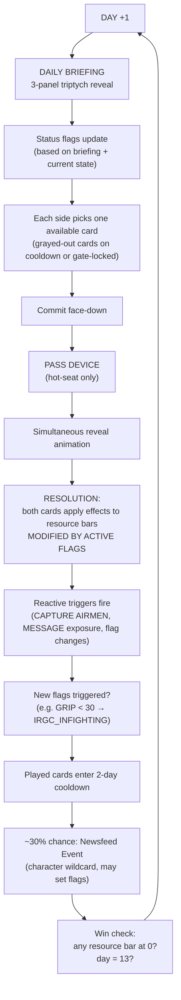

# Operation: CROUCHING LION
## Iran Revolution Card Game — Master Design Document
### Working title · v1 · May 2026

> A turn-based, trick-taking card duel set in the May 2026 Iranian revolution.
> Two players. Two sides. One war, fought in the air, on the sea, in the silenced streets,
> on the world stage — and on social media.

---

## 1. Pitch

**Trump** vs **the IRGC**, played as a clean simultaneous-commit card duel on a 1980s war-room CRT — set entirely at urban night and first-light dawn, never daylight. Each round opens with a **Daily Briefing**: a Truth Social post from Trump, a tweet from an IRGC figure, and a piece of intel (drone footage, smuggled video, intercepted radio). The briefing teaches one factual beat of the actual revolution and may trigger or reveal **status flags** — visible board-state conditions like `NAVAL_BLOCKADE_ACTIVE`, `INTERNET_SHUTDOWN`, `IRAQI_PMF_DEPLOYED`, or `BASIJ_DEFECTING` that modify card effects. Then both sides commit one card from their **asymmetric roster of 9 cards each**, reveal face-up, and apply effects to six resource bars — modified by active flags. The match ends the moment any of the six bars hits 0 — which bar fell decides which of seven endings plays.

The game is fun first, comedic second, educational third. The education comes through *play*, not lectures — every card, every tweet, every piece of intel is grounded in the real conflict, and you have to engage with it to play optimally.

---

## 2. The World, May 2026

Several months have passed since the early-January surge. The HUD ticks a relative day counter that begins at "DAY 1" when the match starts and increments each round — *match-internal time*, not a canonical date. The setting is **May 2026, after the Strike, with the regime headless and the people organizing under blackout**.

### The story so far

- **January 8–9, 2026 — The Surge.** Crown Prince **Reza Pahlavi** organized the call from exile via social media. For 48 hours, *millions* flooded the streets of every Iranian city, chanting *"Javid Shah"* — *Long live the King* — holding Pahlavi's photograph and waving the pre-1979 Lion & Sun flag. The fear evaporated. A nation tasted its first joy in two generations.
- **The Massacre.** The internet went dark. Truck-mounted machine guns opened fire. Body bags ran out; 18-wheelers carried away the bravest. Best estimates from inside Iran: **tens of thousands of souls** in the streets, with tens of thousands more disappeared. The true count is unknown.
- **February 28, 2026 — The Strike.** **Ali Khamenei is dead** — confirmed by the regime itself after days of denial. An **all-female-crewed Israeli airstrike** ended the Supreme Leader on a date the dissident voice has memorized. Tehran neighborhoods erupted in vindictive celebration — the architect of decades of misery, undone by everything his theocracy hated most. **Hossein Salami**, IRGC commander, was killed in the same strike. The regime learned it could bleed.
- **The Cardboard.** **Mojtaba Khamenei** was hastily elected the new Supreme Leader by the Assembly of Experts — but he fell into a coma days later (officially: *"deep prayer for the nation"*). The regime's broadcast apparatus has been propping up an *actual cardboard cutout* of him at staged events ever since. Most Iranians know. The regime knows they know.
- **IRGC Command.** With Salami dead, **Ahmad Vahidi** now commands the Revolutionary Guards. The IRGC is fracturing — Vahidi cannot trust his own conscripts, leading to the desperate import of foreign militia.
- **Today.** The board is set. US + Israel + Pahlavi are aligned. The IRGC is what the dissidents call them: **walking ghosts**. The only question left is the timing of the regime's collapse.

### The conflict, layer by layer

- **Air & drones.** Targeted drone assassinations of IRGC commanders. F-22s and Israeli F-35Is over Natanz, Bushehr, Bandar-e Abbas. MQ-9s loitering off the Gulf. Drone footage is the West's primary intelligence stream.
- **Naval.** US and allied destroyers hold the Strait of Hormuz open. IRGC speedboat swarms harass tankers. Iranian patrol craft burn off Bandar.
- **Economic spiral.** The regime is in a **self-made financial collapse**. To buy time, they printed worthless money, handed out fake loans, made empty promises to workers. The rial is in free-fall. Buying boots, paying rent, taking a bus — *a daily gamble*. To pay the IRGC's salaries the regime is now clawing the same worthless currency back from ordinary depositors. Steel-sector disruptions have crippled military rebuild capacity.
- **Domestic Iran.** Mostly silent under the blackout. Smuggled phone videos punch through sporadically. **General strikes** in the oil and petrochemical sectors are no longer a question of *if* — petrochemical workers in Asaluyeh and South Pars have reached breaking point: *when a wage can no longer buy bread for a worker's family, the regime's lifeblood stops flowing*. **A silent underground network** is forming — ordinary citizens linking with rank-and-file Basij and IRGC defectors who are quietly walking away from the system.
- **Liberated Zones doctrine.** The dissident strategy is now explicit: **secure and hold a few liberated zones**, and the momentum becomes unstoppable. City after city falls. Tehran, Qom, and Mashhad — *the regime's centers of horror* — would topple last, one by one.
- **World stage.** Crown Prince **Reza Pahlavi** speaks weekly from exile, no longer in solitude. **Israel and the Iranian people see themselves as natural allies** — both peoples fighting the same Islamic theocratic tyranny. The IDF strikes *the head of the octopus* (the regime's command, its nuclear program, its proxies' funding); Iranians inside dismantle the tentacles. The dissident voice from inside Iran names the IDF and the Israeli people as **genuine allies** without qualification. The US, Israel, and the Pahlavi camp are aligned. Allied governments coordinate. Sanctions tighten. Russia and China still ship parts to the regime. Hezbollah is brittle. The Houthis flip a tanker every few weeks.
- **Social media.** Both Trump and IRGC officials post freely. Iranian citizens cannot. **This asymmetry is a core mechanic.**

This is the world the cards inhabit.

---

## 3. Tone & Voice

| Faction | Tone | Notes |
|---|---|---|
| **Trump** | Calculated unpredictability — the **madman strategy** | His Truth Social posts deploy classic coercive diplomacy: maximalist threats ("A whole civilization will die tonight"), theatrical branding of operations ("Power Plant Day"), profane directness ("Open the F***in' Strait, you crazy bastards"), casual delivery of extreme stakes ("When you go to war, some people will die"), and deliberate tonal shifts. **This is not incompetence — it's pressure.** The IRGC can't tell where the line is because Trump obscures it on purpose. Every post signals: *I might do anything. You don't know.* He is strategically effective, and the uncertainty is the weapon. Based on real quotes from his Iran-war Truth Social posts and press conferences. |
| **IRGC** | Murderous, paranoid, occasionally ridiculous (Cardboard Mojtaba) | Real villains. Their tweets are threatening. Comic relief comes from regime failure, never from humanizing the regime. |
| **Iranian people / Anonymous Inside Iran** | Dignified, defiant, poetic, voice cracking with grief and soaring with hope | The locked register. **See §3a for canonical voice samples.** Always treated with restraint. Smuggled videos and underground broadcasts are the medium. Mahsa Amini, Bloody January, Evin — never gamified, never gore, always remembered. |
| **Reza Pahlavi** | Calm, statesmanlike, constitutional symbol | Pre-1979 Lion & Sun flag. Not "the next king" — the unifying figure for a transitional government. |
| **Bibi Netanyahu / Israel / IDF** | **Serious, allied, never a punchline** | A neutral-allied figure. Israel and the IDF are framed as **genuine allies of the Iranian people** — not just of Trump's coalition. The Iranian dissident voice itself names them so (see §3a). Bibi appears clear, professional, and determined. **No caricature, no comedic register, no satire at his expense.** Operations are framed as *"striking the head of the octopus while Iranians dismantle the tentacles."* |
| **Other foreign powers** | Cameo characters with distinct voices | Macron measured, Putin cold, Xi opaque, Rubio sharp. Comedy through caricature is reserved for Trump (affectionate) and the regime's failures (sharp). Allied figures are played straight. |

**Visual register:** 16-bit pixel art, late-80s SNES-era arcade, scanline overlay, deep-navy CRT. No photorealism, no cartoon-modern, no anime. The CRT *is the diegesis* — these are the screens the war room would actually show.

**Atmosphere — "Night in Tehran, 3am in the West Wing":** every scene in the game is either **urban night** or **dawn**. Never broad daylight. The dominant lighting is the cold blue of CRT monitors, the warm sodium-orange of streetlamps and refinery flares, the red of regime-bunker work lights, and — at every hopeful turning point — the gold of Lion-and-Sun rays at first light. Trump's screens read as *late-night Situation Room*. IRGC's screens read as *concrete bunker, no windows*. Iranian-side scenes read as *rooftops at 4am, dawn breaking over Azadi Tower*. White is reserved for highlights, scanlines, dawn rays, and chrome — never as a flat background.

### 3a. The voice of the Iranian people (locked register)

This is the most important voice in the game. Every gold-bordered card, every "Anonymous — Inside Iran" newsfeed event, every smuggled-video Intel feed, and every story-ending epilogue must be written in **this register** — adapted from real speeches by an anonymous dissident speaking from inside Iran:

- **Anonymous, face hidden, voice known.** "You cannot see my face. But you know my voice. You have heard it crack with grief and you have heard it soar with hope."
- **Sentences short, line breaks rhythmic.** Bullet-poem cadence, almost biblical. Never slick, never branded — written as if it had been recited into a phone in the dark and smuggled out.
- **Specific over abstract.** "Buying boots, paying rent, taking a bus — a daily gamble." "18-wheelers carried away our bravest children." Never "the people suffered." Always the boots, the bus, the bag.
- **History-aware.** The revolution did not start in 2022 or 2026. It began the second the Islamic Republic hijacked Iran in 1979. Pahlavi walked alone for forty years. The exiled crown was carried with no guarantee of a homeland that would call it back.
- **Defiant, never self-pitying.** "We were no longer waiting to be saved. We were forcing the world to react to us."
- **Names the regime as ghosts.** Direct address to the IRGC and the Basij: *"You are walking ghosts. We see right through you. The streets you patrol no longer belong to you. You are no longer a thing to be feared. You are simply an obstacle waiting to be removed."*
- **Hope without naivety.** "It is finally our turn. We will see each other in Free Iran." / "Iran is waking up."

**Locked phrases** (use verbatim or near-verbatim across newsfeed events, intel feeds, codex copy, and endings):

| Phrase | Where it goes |
|---|---|
| *Javid Shah* (Long live the King) | Surge moments, Pahlavi-address Newsfeed events, restoration ending |
| *We were no longer waiting to be saved* | Mid-match dissident voice; ARM JAVIDAN flavor |
| *Walking ghosts* | Direct address to IRGC; appears when regime is collapsing |
| *Head of the octopus / dismantle the tentacles* | Bibi-strike newsfeed; Mossad cyber unit; codex on proxies |
| *Liberated zones / decisive window* | Strategic doctrine; appears with Trump's ARM JAVIDAN and STREET-theatre wins |
| *Silent underground* | Defection newsfeed; AI VIDEO backfire flavor |
| *The board is set, the pieces are finally in our favor* | Title / opening cinematic; mid-game dissident broadcast |
| *Iran is waking up* | Dawn-side moments; restoration ending epilogue |
| *We will see each other in Free Iran* | Final ending tag — every Trump-side ending closes with this |

The reference texts for this register (full speeches: "To all my brothers and sisters" and "Day 122 — Iran is waking up") will be archived in `03_EDUCATIONAL_LAYER.md` as **canonical voice samples**. Any future writer producing newsfeed copy must read those before writing.

> **Why this matters:** the gold thread in the Lion & Sun palette IS this voice. If the green (Trump) and red (IRGC) cards do all the talking, the game becomes a war-room simulator. It is the gold cards — the smuggled videos, the anonymous broadcasts, the dawn-light rooftop scenes — that make this a game *about* the Iranian people's revolution, not just a game *over* Iran. Every word in those cards has to carry the actual register of someone speaking from inside the blackout.

### 3b. The voice and role of Reza Pahlavi (locked political position)

Pahlavi appears in the game as a Newsfeed Event card (gold-trimmed, green-bordered) and as a recurring figure in the Daily Briefing. His register is **calm, dignified, statesmanlike** — the calm that comes from forty years of solitude. He is the strategic counterweight to MAXJAW Trump's chaos and the dignified counterweight to the regime's hysteria.

**Biographical facts the game treats as canonical** (referenced in flavor and Codex; never gamified):

- Born **1960**. Son of Mohammad Reza Pahlavi, the last Shah.
- **Seventeen** when his family was driven into exile in 1979.
- His father died in Egypt within two years. His sister **Leila** and his brother **Alireza** died by suicide. His family endured a slow erasure that informs the patience and grief in every public statement.
- **Forty-plus years of consistent advocacy** for non-violent resistance and a secular democratic Iran. Mocked by the regime, ignored by Western politicians who preferred appeasing the theocracy.
- Organized the **January 8–9, 2026 surge** from exile via social media. His influence inside Iran is immense — measurable in the dramatic drop in his social-media interactions every time the regime imposes a blackout.

**The locked political position** (this is the most important note in the entire document for tone):

| Pahlavi is *not*… | Pahlavi *is*… |
|---|---|
| A king-in-waiting | A unifying figure for transition |
| A campaigner for absolute monarchy | An advocate for **a referendum** in which the Iranian people decide the form of government |
| His father's politics | His father's redemption |
| A man with blood on his hands | A man with no blood on his hands — unique among any opposition voice |

**The Iran Prosperity Project** — Pahlavi's concrete plan — is the game's canonical political endpoint. It is a detailed proposal to transition Iran to a **dynamic secular democracy based on the rule of law and human rights**, culminating in a national referendum. *If* the Iranian people vote for a constitutional monarchy, the Pahlavi family serves in a **custodial role** — protecting Iranian culture and connecting the people to their history — while elected representatives and democratic institutions hold the actual governing power. *If* they vote for a republic, the Pahlavi family steps fully aside.

**The "monarchists for democracy" insight** — not a contradiction, but the only viable strategic path when tyranny has crushed every other opposition route. The game treats Pahlavi's supporters as ruthless political realists, not sycophants.

**Locked Pahlavi phrases** (use across his Newsfeed event, the RESTORATION ending epilogue, and codex copy):

| Phrase | Where it goes |
|---|---|
| *Iran Prosperity Project* | Pahlavi-address newsfeed; Codex; RESTORATION ending |
| *A referendum decides Iran's future* | Restoration epilogue; codex |
| *Custodial role, not a crown* | Codex; ending epilogue |
| *Monarchists for democracy* | Codex; one of Trump's CONFUSE Truth Social posts can refer to it (in MAXJAW voice) |
| *I have walked this path alone for forty years; I will not walk it alone now* | Pahlavi-address newsfeed (paraphrased) |
| *I do not seek a throne. I seek a free Iran.* | Restoration ending opening line |

**The complex legacy of his father** is *not* whitewashed. Where the Codex covers the Pahlavi era, it lists the Shah's modernization, land reforms, and women's-rights expansion alongside the corruption charges and authoritarian suppression of dissent. Pahlavi support in the game is **strategic-pragmatic**, not nostalgic. The point is what he offers *now* — a no-blood-on-his-hands transition figure — not a return to the past.

---

## 4. Player Roles & Modes

The player picks a side at the start of each match.

- **Side A — JAW-MAXX TRUMP / CENTCOM Dispatch.** You play from a US war room. Your tools are drones, navy, allied diplomacy, and Truth Social. Your goal: collapse the regime in 13 days.
- **Side B — IRGC HIGH COMMAND / Tehran Bunker.** You play from a hardened bunker. Your tools are SAMs, speedboats, propaganda, and proxy networks. Your goal: outlast the offensive — break Trump's political will, break the coalition, or take a high-value hostage.

### Modes

- **Solo vs AI.** Three difficulty tiers (hand-peek depth + RNG bias).
- **2-player hot-seat.** Pass-and-play on one device. After both sides commit face-down, a "PASS DEVICE" interstitial covers the screen until the next player taps to reveal.
- (Future, not in v1.) Network multiplayer.

---

## 5. The Lion & Sun — Color, Symbol, and Status Flags

### 5a. Color logic (the pre-1979 flag is the game's palette)

The pre-1979 Iranian flag bears four colors: **green, white, red, gold**. The game uses that exact palette as its core visual language, layered over a deep-navy night.

| Flag color | Hex | In the game |
|---|---|---|
| **Green** | `#52ff8f` (neon) / `#1ecc5e` (deep) | **MAXJAW Trump / liberation forces.** Trump's card border, his HUD, success flashes when his moves land. |
| **Red** | `#ff5a67` (neon) / `#c0222e` (deep) | **IRGC / regime.** IRGC card border, Tehran-Bunker HUD, atrocity flashes. |
| **Gold** | `#ffd24a` | **The Iranian people / the Lion & Sun emblem.** Border on Newsfeed event cards (Pahlavi address, smuggled videos, strikes, defections). The game's *soul* — the silent center the green and red contest over. |
| **White** | `#fafff7` (off-white) | **Highlights only.** Scanlines, dawn rays, chrome edges, text glow. **Never a background field.** |
| Deep navy | `#06080c` | The night. The *only* background color. Every scene takes place against it. |

The game's visual narrative: green and red contest the screen, but the win condition is **gold rising** — the Lion & Sun lifted at dawn over a free Tehran.

### 5b. Status Flags (the visible board state)

The conflict is shaped by **status flags** — binary conditions that represent real events in the war. These flags are visible on the game board, triggered by card plays or events, and modify card effects in intuitive ways. This replaces abstract theatre modifiers with concrete, narrative-driven game state.

**Military / Naval:**

| Flag | Triggered by | Effect while active |
|------|--------------|---------------------|
| `CARRIER_GROUP_PRESENT` | ESCORT, or starts true | AIRSTRIKE +3 LEV; HARASS THE STRAIT riskier (−3 PROXY) |
| `NAVAL_BLOCKADE_ACTIVE` | BLOCKADE | IRGC WAR CHEST drains −2/day; SELL OIL +3 LEV |
| `TANKERS_SEIZED` | HARASS THE STRAIT crit | Trump POL CAP −5; enables IRGC leverage plays |
| `ISRAELI_STRIKES_ONGOING` | Newsfeed event or starts true | GRIP damage +2 on all Trump cards |

**Communications:**

| Flag | Triggered by | Effect while active |
|------|--------------|---------------------|
| `INTERNET_SHUTDOWN` | Starts true | AI VIDEO and MESSAGE stronger (+2 GRIP); smuggled videos rarer |
| `STARLINK_ACTIVE` | Newsfeed event | Counters INTERNET_SHUTDOWN; AI VIDEO can backfire |

**Foreign Militia (deployed separately, as it happened):**

| Flag | Triggered by | Effect while active |
|------|--------------|---------------------|
| `IRAQI_PMF_DEPLOYED` | IMPORT MILITIA (first play) | +3 GRIP but NIGHTLY RALLY disabled; Trump STREET cards +2 |
| `AFGHAN_FATEMIYOUN_DEPLOYED` | IMPORT MILITIA (second play or high desperation) | +3 GRIP but PROXY −5; world outrage (+3 ALL for Trump) |

**Internal Iran — Regime:**

| Flag | Triggered by | Effect while active |
|------|--------------|---------------------|
| `KHAMENEI_CONFIRMED_DEAD` | Starts true | MESSAGE has 10% exposure risk (up from 5%) |
| `MOJTABA_INCAPACITATED` | Starts true | MESSAGE exposure triggers CARDBOARD MOJTABA ending |
| `IRGC_INFIGHTING` | GRIP < 30 | All IRGC cards −2 effect |
| `SECURITY_FORCES_UNPAID` | WAR CHEST < 20 | GRIP drains −2/day |
| `BASIJ_DEFECTING` | Newsfeed event or GRIP < 25 | EXECUTE DISSIDENTS backfires; ARM JAVIDAN +3 |
| `MARTIAL_LAW` | IRGC plays after GRIP < 35 | Temporary GRIP +5, but ALLIES +5 for Trump (world outrage) |

**Internal Iran — Resistance:**

| Flag | Triggered by | Effect while active |
|------|--------------|---------------------|
| `MASSACRE_MOURNING` | Days 1–5 (40-day Arba'een from January) | EXECUTE DISSIDENTS triggers mass protest; GRIP −8 |
| `MASS_PROTESTS_RESUMED` | Newsfeed event or GRIP < 30 | GRIP drains −3/day; ARM JAVIDAN unlocked |
| `GENERAL_STRIKE_ACTIVE` | Newsfeed event | WAR CHEST drains −5/day |
| `OIL_DUMPING` | WAR CHEST < 15 and BLOCKADE active | Regime destroying reserves; WAR CHEST collapse accelerates |
| `LIBERATED_NEIGHBORHOODS` | ARM JAVIDAN + 2 consecutive Trump wins | Path to RESTORATION ending |

**Economic:**

| Flag | Triggered by | Effect while active |
|------|--------------|---------------------|
| `SANCTIONS_MAXIMUM` | SANCTION played twice | WAR CHEST −3/day; DIPLOMACY more attractive |

The board displays active flags as icons, making the game state readable at a glance. Each flag tells a story beat from the actual conflict — and teaches the player what these events actually mean.

---

## 6. The Daily Briefing (the round opener)

This is the educational and comedic engine of the game. **Every round opens with a triptych** of three war-room intercepts.

> **Visual rule (locked):** the panels are rendered in the game's own pixel-CRT typography and palette. **No social-media branding ever appears.** No Twitter blue, no Truth Social red, no Telegram cyan, no Twitter/X bird, no platform UI. These are *intercepted communications* and *state-media broadcasts* the war room is reading — diegetic, 80s-SIGINT-printout register, not modern social-media feed register. Each panel shows a **portrait + transmission-type label + message text** in the locked color of the speaker's side (green for Trump, red for IRGC, gold for Iranian/dissident, off-white for intel/SIGINT).

```
┌─────────────────┬─────────────────┬─────────────────┐
│ POTUS POST       │ STATE BROADCAST  │ INTEL FEED      │
│ (TRUTH SOCIAL)  │ (IRGC OFFICIAL) │ (DRONE / SIGINT)│
│ [portrait]      │ [portrait]      │ [scene thumb]   │
│                 │                 │                 │
│ all-caps text  │ EN + FA         │ 60-word context │
│ green trim      │ red trim        │ gold trim       │
└─────────────────┴─────────────────┴─────────────────┘
                  ↓
         STATUS FLAGS UPDATED
    [icons showing active flags]
    e.g. 🚢 BLOCKADE  📡 BLACKOUT  🔥 PROTESTS
```

Each panel uses the **same chrome template** (the *Communication Panel* in §12h) — only the trim color, label string, portrait, and text content vary. This means we generate **portraits and intel scenes once**, and all 25 Truth Social posts / 25 IRGC tweets / 25 Intel Feeds are rendered at runtime by composing template + portrait + text + scene thumb.

### Why three panels?

| Panel | Function | Educational role |
|---|---|---|
| Truth Social post | Comedic / strategic frame from MAXJAW Trump | Shows how the West's leadership talks about the war — for better or worse |
| IRGC tweet | Threat / propaganda from a real regime figure (Salami, Khamenei official, Qaani, Ghalibaf, IRIB) | Teaches the regime's actual rhetorical style; illustrates that *they* still have a platform while ordinary Iranians don't |
| Intel feed | Drone footage / smuggled video / intercept (with 60-word context paragraph, collapsible) | Teaches the ground truth of the day — the actual fact |

The three panels frame the **day's theme**. Examples:

#### Example briefings

**Day 3 — "Hormuz Under Pressure"**
- Truth Social (3:14 AM ET): `"STRAIT IS OPEN!!! TANKERS MOVING. LOSER REGIME COWARDS RUNNING. TREMENDOUS DAY FOR FREEDOM!!!"`
- @sepahnews (Vahidi): `"The arrogant gambling has reached its end. The vipers will perish in the waters of the Persian Gulf — مرگ بر آمریکا"`
- Intel: Dawn drone footage — US destroyer escorting a tanker through the strait under first light, burning IRGC patrol craft visible to port.
- **Status flags:** `NAVAL_BLOCKADE_ACTIVE` ✓ `CARRIER_GROUP_PRESENT` ✓

**Day 7 — "Cardboard Mojtaba"**
- Truth Social (2:47 AM ET): `"They are using a CARDBOARD CUTOUT of their so-called SUPREME LEADER. CARDBOARD!!! Folks, this is what desperation looks like. SAD!"`
- @khamenei_ir official: `"His Eminence is in deep prayer for the nation. The slanders of the enemy will not stand."`
- Intel: Smuggled phone video at midnight, lit by stage lights from a state-TV set — the side angle of the cutout, gaffer tape visible.
- **Status flags:** `MOJTABA_INCAPACITATED` exposed → triggers `IRGC_INFIGHTING`

**Day 10 — "The Streets Are Moving"**
- Truth Social (4:02 AM ET): `"IRAN IS RISING!!! The people are INCREDIBLE. PRINCE PAHLAVI — GREAT GUY, GREAT FAMILY. He's the ONE. Watch him tonight. HUGE!"`
- @sepahnews (Vahidi): `"Foreign mercenaries and traitors will be crushed. The Sepah stands eternal."`
- Intel: Smuggled rooftop video from Shiraz — thousands in the streets at 3am, chanting *"Javid Shah"* — Lion & Sun flags visible.
- **Status flags:** `MASS_PROTESTS_RESUMED` ✓ `BASIJ_DEFECTING` ✓ `GENERAL_STRIKE_ACTIVE` ✓

### Briefing copy bank size

- **Truth Social posts:** 25 (rotated per match; written in actual Trump voice — all-caps comedic).
- **IRGC tweets:** 25, one per major regime figure (Salami, Khamenei official, Qaani, Ghalibaf, Taeb, Larijani, Iravani at UN, IRIB official, Nilufari/Basij, Shamkhani, Rezaee, etc.). Each in EN + FA.
- **Intel feeds:** 25 (drone, smuggled video, radio intercept), each with 60-word context paragraph.

A 13-day match draws ~13 briefings without repeats. There's slack in the bank for re-rolls and replay value.

---

## 7. Round Flow



A round takes ~45 seconds in solo, ~90 seconds in hot-seat. A full 13-day match is ~10–20 minutes — a single sitting.

---

## 8. Resources & Resolution

### 8a. The six resource bars (3 vs 3)

Each side has three resource bars, each clamped 0–100. These are the win/loss substrate; cards push them up or down.

| Side | Bar | Starts at | What pushes it down |
|---|---|---|---|
| **TRUMP (green)** | LEVERAGE | 30 | IRGC scores against US pressure (e.g. CAPTURE AIRMEN, AI VIDEO) |
| | POL CAP | 60 | Costly moves (AIRSTRIKE, INVADE), domestic backlash |
| | ALLIES | 50 | Reckless moves (CONFUSE, SELL OIL), allied pressure |
| **IRGC (red)** | GRIP | 45 | Drone strikes, ARM JAVIDAN, exposed propaganda |
| | WAR CHEST | 50 | SANCTION, BLOCKADE, SELL OIL, INVADE |
| | PROXIES | 50 | Houthi/Hezbollah losses, ARM JAVIDAN |

A bar at 0 is an **immediate match-end** — see §10.

### 8b. Resolution sequence (each round)

After both sides reveal:

1. **Check active status flags** — compile the list of modifiers that will apply this round.
2. **Trump's card resolves first** — its effects apply to *both* sides' bars, **modified by active flags**.
3. **IRGC's card resolves** — same rule.
4. **Reactive triggers fire** in this order:
   - `AIRSTRIKE` sets `airstrikeUsed` (enables CAPTURE AIRMEN gate).
   - AI VIDEO exposure check: if `STARLINK_ACTIVE` and IRGC plays AI VIDEO, it backfires (−15 GRIP instead of +2).
   - MESSAGE exposure check: 10% chance (because `KHAMENEI_CONFIRMED_DEAD`) that "Mojtaba is in a coma" leaks → −15 GRIP and triggers the Cardboard Mojtaba reveal.
   - EXECUTE DISSIDENTS: if `MASSACRE_MOURNING` active, triggers mass protest (−8 GRIP); otherwise queues **martyr aftermath** (−6 GRIP next round).
5. **Status flag updates** — check thresholds:
   - GRIP < 30 → `IRGC_INFIGHTING` activates
   - GRIP < 25 → `BASIJ_DEFECTING` activates
   - WAR CHEST < 20 → `SECURITY_FORCES_UNPAID` activates
   - WAR CHEST < 15 + `NAVAL_BLOCKADE_ACTIVE` → `OIL_DUMPING` activates
6. **Passive flag drains** — if `GENERAL_STRIKE_ACTIVE`: WAR CHEST −5; if `MASS_PROTESTS_RESUMED`: GRIP −3; etc.
7. **Cooldown:** the played cards become unplayable for 2 days.

### 8c. Status flag effects, illustrated

**Scenario:** `NAVAL_BLOCKADE_ACTIVE` and `ISRAELI_STRIKES_ONGOING` are both active.

Trump plays AIRSTRIKE (`base: +6 LEV, −8 POL / −3 GRIP, −5 CHEST`):
- `ISRAELI_STRIKES_ONGOING` adds +2 to GRIP damage → −5 GRIP total
- Final: `+6 LEV, −8 POL / −5 GRIP, −5 CHEST`

IRGC plays HARASS THE STRAIT (`base: −3 LEV, −6 POL, −2 ALL / −5 PROXY`):
- `CARRIER_GROUP_PRESENT` makes this riskier → additional −3 PROXY
- Final: `−3 LEV, −6 POL, −2 ALL / −8 PROXY`

The flags create readable, narrative-driven modifiers: *of course* harassing the strait is riskier when a carrier group is present.

---

## 9. The Asymmetric Rosters

This is the heart of the game. The two sides have **9 cards each**, but they are *not* mirrored — every card on each side is unique and pulled directly from the actual conflict. There is no draw pile and no shuffle: every card is **always visible** in your hand, and the strategic question is *which of my available moves to commit and when*. After a card is played, it's locked on a **2-day cooldown**. Card effects are modified by **active status flags** (see §5b).

### 9a. Trump's roster — 9 cards (green border)

| # | Card | Gate | Base Effects (Trump / IRGC) | Flag Interactions | Voice |
|---|------|------|-----------------------------|--------------------|-------|
| 1 | **CONFUSE** | — | +3 LEV, −5 ALL / −4 GRIP | If `IRGC_INFIGHTING`: −6 GRIP | *"WHAT A TIME TO BE ALIVE!!! BIG DEALS COMING!!!"* |
| 2 | **AIRSTRIKE** | POL ≥ 30 | +6 LEV, −8 POL / −5 CHEST, −3 GRIP | Sets `airstrikeUsed`. If `CARRIER_GROUP_PRESENT`: +3 LEV. If `ISRAELI_STRIKES_ONGOING`: −2 additional GRIP | *"Strike confirmed. Target neutralized."* |
| 3 | **BLOCKADE** | — | +5 LEV, −2 POL / −8 CHEST | Sets `NAVAL_BLOCKADE_ACTIVE`. If already active: +3 LEV | *"Strait closed to regime tankers. End of story."* |
| 4 | **ESCORT** | — | +2 LEV, −1 POL, +6 ALL / 0 | Sets `CARRIER_GROUP_PRESENT` if not active | *"Allied tankers move under our flag tonight."* |
| 5 | **SANCTION** | — | +4 LEV, +2 ALL / −6 CHEST | Second play sets `SANCTIONS_MAXIMUM` (WAR CHEST −3/day) | *"Frozen. Every account. Every shell company."* |
| 6 | **DIPLOMACY** | ALL > 0 | +2 LEV, +8 ALL / −3 PROXY | If `SANCTIONS_MAXIMUM`: more attractive to IRGC | *"Big beautiful deal coming. Trust me, folks."* |
| 7 | **SELL OIL** | ALL ≥ 10 | +5 LEV, −3 ALL / −10 CHEST | If `NAVAL_BLOCKADE_ACTIVE`: +3 LEV | *"Texas oil, Texas prices. Ayatollahs feel it tomorrow."* |
| 8 | **ARM JAVIDAN** | ALL ≥ 20 | +6 LEV, −1 ALL / −5 GRIP, −2 PROXY | If `BASIJ_DEFECTING`: +3 GRIP damage. If `MASS_PROTESTS_RESUMED`: unlocks `LIBERATED_NEIGHBORHOODS` | *"Crates landing tonight. The Lion stirs."* |
| 9 | **INVADE** | POL ≥ 50, ALL ≥ 40 | +15 LEV, −20 POL, −10 ALL / −25 CHEST, −10 GRIP | If `LIBERATED_NEIGHBORHOODS`: triggers RESTORATION. Otherwise: triggers GROUND ZERO | *"Marines on Bandar at first light."* |

### 9b. IRGC's roster — 9 cards (red border)

| # | Card | Gate | Base Effects (Trump / IRGC) | Flag Interactions | Voice |
|---|------|------|-----------------------------|--------------------|-------|
| 1 | **HARASS THE STRAIT** | PROXY ≥ 20 | −3 LEV, −6 POL, −2 ALL / −5 PROXY | If `CARRIER_GROUP_PRESENT`: additional −3 PROXY. Critical success: sets `TANKERS_SEIZED` | *"We do not retreat from our waters."* |
| 2 | **ATTACK NEIGHBORS** | PROXY ≥ 30 | −2 LEV, −3 POL, +5 ALL (Gulf recoil) / −8 PROXY | Sets `GULF_STATES_HIT`. If already set: Trump ALL +3 (coalition rallies) | *"We strike anywhere we choose."* |
| 3 | **EXECUTE DISSIDENTS** | GRIP ≥ 25 | +4 ALL (world condemns) / +3 GRIP | If `MASSACRE_MOURNING`: backfires → −8 GRIP. If `BASIJ_DEFECTING`: backfires → −5 GRIP | *"The traitors paid the price at first light."* |
| 4 | **CAPTURE AIRMEN** | `airstrikeUsed`, PROXY ≥ 25 | −10 LEV, −15 POL, −3 ALL / −8 PROXY | Sets `AIRMEN_CAPTURED`. Only available after AIRSTRIKE | *"We have the airman. Negotiate."* |
| 5 | **AI VIDEO** | — | −2 LEV / +2 GRIP | If `INTERNET_SHUTDOWN`: +2 GRIP. If `STARLINK_ACTIVE`: backfires → −15 GRIP | *"Glorious advance of the Sepah."* |
| 6 | **FREE HIJAB** | — | 0 / +3 GRIP | Signals weakness: if `MASS_PROTESTS_RESUMED` not set, 40% chance to trigger it | *"We listen to our daughters. (Reluctantly.)"* |
| 7 | **NIGHTLY RALLY** | — | −3 ALL / +3 GRIP, +1 PROXY | Disabled if `IRAQI_PMF_DEPLOYED` or `AFGHAN_FATEMIYOUN_DEPLOYED` (can't fake domestic support) | *"Hundreds of thousands love their leader."* |
| 8 | **MESSAGE** | — | −2 LEV / +4 GRIP, +2 PROXY | 10% exposure chance (Khamenei dead, Mojtaba in coma). If exposed: −15 GRIP, triggers CARDBOARD MOJTABA | *"His Eminence has spoken from his place of deep prayer."* |
| 9 | **IMPORT MILITIA** | CHEST ≥ 15, PROXY ≥ 20 | +3 ALL (outrage) / +5 GRIP, −15 CHEST, −10 PROXY | First play: sets `IRAQI_PMF_DEPLOYED`. Second play: sets `AFGHAN_FATEMIYOUN_DEPLOYED`. Disables NIGHTLY RALLY. 25% triggers `Foreign Enforcers Visible` newsfeed | *"Loyal forces from beyond our borders strengthen the Sepah."* |

### 9c. Tweets / posts as cards

Tweets and posts already live in the roster as **CONFUSE** (Trump's chaotic Truth Social) and **AI VIDEO** + **MESSAGE** (IRGC's social and supreme-leader broadcasts). They reach across the internet blackout — only people with platforms can post. Ordinary Iranians cannot. *That asymmetry is mechanical and pedagogical.* The `INTERNET_SHUTDOWN` and `STARLINK_ACTIVE` flags modify how these cards perform.

The Daily Briefing's three panels (Truth Social + IRGC tweet + Intel) are *not* cards in the roster — they are **flavor framing** that updates the player on active status flags and may trigger new ones. They are written in the same voices as the in-roster tweet cards, so the player learns to read both.

### 9d. Hand layout (no draw pile)

```
┌──────────────────────────────────────────────────────────────────┐
│              SITUATION MAP — PERSIAN GULF (3:14 AM)              │
│           Resource bars + ACTIVE STATUS FLAGS                    │
│   🚢 BLOCKADE  ✈️ CARRIERS  📡 BLACKOUT  🔥 PROTESTS              │
├──────────────────────────────────────────────────────────────────┤
│   YOUR ROSTER (always visible; greyed = on cooldown / gated)     │
│   [CONFUSE] [AIRSTRIKE] [BLOCKADE] [ESCORT] [SANCTION]           │
│   [DIPLOMACY] [SELL OIL] [ARM JAVIDAN] [INVADE]                  │
├──────────────────────────────────────────────────────────────────┤
│                    DAILY BRIEFING TRIPTYCH                       │
├──────────────────────────────────────────────────────────────────┤
│   [YOUR COMMITTED CARD ▼]        VS        [OPPONENT CARD ▼]     │
└──────────────────────────────────────────────────────────────────┘
```

No deck-back, no shuffle, no draw pile. The full asymmetric roster is your strategic vocabulary, and cooldowns / gates / **active status flags** shape what's actually playable and how effective each card will be.

---

## 10. Win Conditions & Endings

### Default win — first resource bar to hit 0

The match ends the moment **any of the six resource bars reaches 0**. Which bar collapsed determines which ending plays. There are six core endings + one stalemate.

| Bar that fell to 0 | Winner | Ending | Tone |
|---|---|---|---|
| **GRIP** | Trump | **THE LION RISES** | The Lion & Sun rises over Azadi Tower at dawn. Pahlavi-led transition begins. *Most hopeful ending.* |
| **WAR CHEST** | Trump | **BANKRUPT** | Refinery silent at golden hour, oil workers on strike, regime can't pay its proxies. Slow collapse. |
| **PROXIES** | Trump | **PROXY NETWORK BROKEN** | Abandoned Hezbollah outpost at dusk, dust on a leaning IRGC pennant. Regime is alone. |
| **LEVERAGE** | IRGC | **STRATEGIC SURRENDER** | Empty Oval Office at 2am, "TEHRAN ACCORDS" folder on the desk, lamp still on. Defeat without battle. |
| **POL CAP** | IRGC | **IMPEACHMENT** | Empty Resolute Desk after midnight, MAGA cap left behind, a "BREAKING" chyron glow. |
| **ALLIES** | IRGC | **COALITION COLLAPSED** | Empty G20 table at night, name plates being removed. The world walks away. |

### Stalemate

| Trigger | Ending | Tone |
|---|---|---|
| **Day 13 reached** with no bar at 0 | **MARATHON** | Two runners on a long road into a slowly rising sun; one carries a small Lion & Sun pennant. *Hopeful tired stalemate.* |

### Story endings (override default)

A small number of specific card combinations trigger named cinematic endings *before* a bar falls. These are the climactic moments — pulled from the actual revolution.

| Trigger | Ending | Tone |
|---|---|---|
| IRGC plays **MESSAGE** and the 5% exposure check fires while GRIP < 35 | **CARDBOARD MOJTABA REVEALED** → forces immediate GRIP collapse → **THE LION RISES** | Comedic-yet-cathartic. The world sees the cardboard cutout. The regime is laughed out of legitimacy. |
| Trump plays **DIPLOMACY** with ALLIES > 80 and IRGC GRIP > 60 | **THE GRAND BARGAIN** | Morally complex. A deal is struck; the regime survives; Trump claims victory; the Iranian people are betrayed. (Epilogue handles this honestly.) |
| Trump plays **INVADE** and wins the round | **GROUND ZERO** | Sober, ambivalent. Marines at Bandar. Real cost of a kinetic ending. |
| Trump plays **ARM JAVIDAN** then wins three consecutive rounds | **RESTORATION** | The dignified ending. *"I do not seek a throne. I seek a free Iran."* The **Iran Prosperity Project** begins: a transitional government convenes; a national referendum is set; Pahlavi takes a **custodial role**, not a crown. Civilian-led, non-violent, grounded. *Most aligned with the game's politics — and the only ending in which the Iranian people, not airpower, decide the war.* |

Every ending closes with **2–3 sentences of epilogue** explaining what that outcome would *actually* mean for Iran and the region. The epilogue is the game's didactic moment — the only place it speaks directly to the player.

**Trump-side endings close with the locked dissident sign-off:** *"We will see each other in Free Iran."* (§3a)

**IRGC-side endings close with a sober epilogue, no triumphalism**, framing what regime survival would actually cost the Iranian people. The dissident voice still appears — quieter, persistent: *"Stay with us. Amplify our voice. We are writing the final chapter of this dictatorship."*

**Stalemate (MARATHON) closes with:** *"Iran is waking up. The board is set, and the pieces are finally in our favor. The only question left is the timing of its collapse."*

---

## 11. Educational Approach

The game teaches without lecturing. Three layers:

### Layer 1 — In-play (mandatory engagement)

- **Daily Briefing triptych** every round. Player must read it (or skim it) to know today's theatre. ~13 facts per match.
- **Card flavor.** Every card has a 1-sentence English voice + a Persian phrase where appropriate. 18 in-roster cards (Trump 9 + IRGC 9) + ~30 newsfeed events × 1–2 facts each.
- **Asymmetric rosters as lesson.** The two sides have different toolkits because the *real* sides do. Trump has air, sea, sanctions, diplomacy, and a wild Truth Social; the IRGC has speedboat swarms, drone-rocket terror, executions, social-control levers, and propaganda. Playing both sides teaches the actual structure of the conflict more honestly than any narration could.
- **Reactive triggers.** CAPTURE AIRMEN only exists *because* Trump played AIRSTRIKE — the player learns that escalation creates the regime's leverage. AI VIDEO backfiring against truth-on-the-ground teaches that propaganda fails when reality is out. MESSAGE's 5% exposure teaches that the supreme leader is in fact in a coma.

### Layer 2 — Out-of-play (optional deep-dive)

- **Free Iran Codex** — a persistent reference screen, accessed from the main menu. ~25 topical articles: Mahsa Amini, Bloody January (Jan 8–9 surge), Lion & Sun, Hyperinflation, Internet Blackout, Drone Doctrine, **Reza Pahlavi (life, family, and forty years of solitude)**, **The Iran Prosperity Project**, **The complex legacy of the last Shah** (modernization + women's rights *and* corruption + authoritarian suppression — never whitewashed), **Monarchists for Democracy (the strategic-pragmatist case)**, **Khamenei: February 28 Strike**, Cardboard Mojtaba, Liberated Zones, Silent Underground, IRGC structure, Basij, Khamenei succession, Hezbollah, Houthis, Mossad, MEK, Persian Gulf geography, Strait of Hormuz, **Imported Militias** (Hezbollah / Iraqi PMF / Afghan Fatemiyoun deployed inside Iran because Iranian conscripts are defecting — what the dissident voice calls *"the tentacles pulled inward"*).
- **Codex unlock-on-play.** When a card or briefing references a Codex topic, the topic becomes "highlighted" in the menu. Encourages reading without forcing it.

### Layer 3 — End-of-match epilogue

- 2–3 sentences after every ending, framing the real-world meaning of that outcome. The only direct authorial voice in the game.

### Sensitivity rules (locked)

- Massacre count (~40,000) framed factually, never numerically gamified. Never a score.
- Evin executions implied via empty-yard / white-rose imagery, never depicted. (The most sensitive image in the project.)
- Persian text is **never baked into images** — always overlaid via the `Vazirmatn` font so it can be edited and translated cleanly.
- Reza Pahlavi is a **transitional unifying figure**, not "the next king." His canonical position (per §3b) is the **Iran Prosperity Project** → national referendum → custodial role for the Pahlavi family if the people choose constitutional monarchy, or full step-aside if they choose a republic. Tone: calm, statesmanlike, dignified, never triumphalist. The Codex frames the *complex legacy* of his father honestly — modernization and women's-rights expansion alongside corruption and authoritarian suppression — and Pahlavi support in the game is strategic-pragmatic, not nostalgic.
- Iranian people are **never the joke**. Comedy is always at the regime's expense (Cardboard Mojtaba) or Trump's expense (MAXJAW caricature). Never at the people's expense.
- Real diaspora and resistance figures (MEK, Pahlavi family, named activists) are referenced respectfully and accurately.

---

## 12. Visual Style

Fresh art for every asset. Style is locked.

### 12a. Palette — the Lion & Sun on a deep navy night

The pre-1979 Iranian flag is the game's color logic, layered over a single background: the night.

| Role | Hex | Notes |
|---|---|---|
| **Night (background)** | `#06080c` | The only background. Every scene is set against this. |
| **Trump green (neon)** | `#52ff8f` | Card border, HUD bars, success flashes |
| **Trump green (deep)** | `#1ecc5e` | Shadow tone for Trump-side art |
| **IRGC red (neon)** | `#ff5a67` | Card border, regime HUD, atrocity flashes |
| **IRGC red (deep)** | `#c0222e` | Shadow tone for regime art |
| **Pahlavi gold** | `#ffd24a` | Lion & Sun emblem, Iranian-people newsfeed cards, dawn rays |
| **Off-white highlight** | `#fafff7` | Scanline highlights, dawn rays, chrome edges, text glow. **Never a background.** |
| **Streetlamp orange** | `#ff9e3a` | Sodium-vapor city lighting, refinery flares, war-chest indicator |
| **Bunker amber** | `#ffd54a` | Tehran-Bunker work-light glow, regime warning indicators |
| **Skin warm / shadow** | `#f4c89c` / `#a86c4a` | Faces |

Each individual scene should restrict itself to ~8–10 of these hexes, never introducing new colors.

### 12b. Atmosphere — *every* scene is night or dawn

This is a hard-locked rule for every prompt:

| Setting | Lighting | Mood |
|---|---|---|
| **CENTCOM Situation Room** | 3am — cold blue CRT light, single yellow desk-lamp | Sleepless, heavy, Trump alone with the screens |
| **Tehran Bunker** | windowless red work-lights, harsh shadows | Paranoid, claustrophobic |
| **Strait of Hormuz** | dawn — pre-sunrise gold rim on water, sodium lamps on tankers | The hour drone strikes happen |
| **Iranian streets** | 4am rooftops, sodium streetlamps, faint dawn glow on Azadi Tower | The hour smuggled videos are filmed |
| **Refineries / oil fields** | golden-hour dusk or dawn, flares lit | The economic engine fading |
| **Pahlavi addresses / hopeful beats** | dawn breaking through a studio window, gold rim on Lion & Sun flag | The hour of restoration |
| **Endings** | each carries its own night/dawn signature — see §10 endings table |

**No noon scenes. No bright midday. No clear-sky daylight.** If a scene seems to call for it (e.g. an air strike), shoot it at first light or last light — both more cinematic and more accurate to the actual cadence of the war.

### 12c. Card border-color rules (bound to side)

| Card source | Border color |
|---|---|
| Trump's 9-card roster | Green (`#52ff8f`, glowing 1–2px) |
| IRGC's 9-card roster | Red (`#ff5a67`) |
| Newsfeed events featuring foreign allies (Bibi, Macron, Rubio, Pahlavi) | Green inner / off-white outer |
| Newsfeed events featuring foreign regime supporters (Putin, Xi, Hezbollah, Houthis) | Red inner / off-white outer |
| Newsfeed events featuring **Iranian people** (smuggled videos, protests, defections, Mahsa, strikes) | **Gold** (`#ffd24a`) — the soul of the game |

### 12d. Fonts (overlay only, never baked into art)

- `Press Start 2P` — HUD chrome, headers, button labels
- `VT323` — body text, briefing paragraphs
- `Vazirmatn` — all Persian text, RTL

### 12e. Style header (paste at start of every image prompt)

```
16-bit pixel art, late 80s/early 90s SNES-era arcade game style.
Limited 8–12 color palette per scene from the locked Lion-and-Sun palette
(deep-navy night, Trump green, IRGC red, Pahlavi gold, off-white highlight,
streetlamp orange, bunker amber, warm skin tones).
Heavy 1px black outlines, flat cel-shading, no anti-aliasing, no gradients,
scanline-friendly. SCENE LIGHTING: night or dawn ONLY — never midday.
```

### 12f. Asset taxonomy (locked — 5 types, 5 sizes)

The game canvas is **1280 × 720**. Every image source lives at one of five native sizes; UI scales source images to display sizes only at integer multipliers (1× / 2× / 3×) using `image-rendering: pixelated`. No fractional scaling, no anti-aliasing introduced at runtime.

| # | Type | Native px | Aspect | Display sizes (1× / 2× / 3×) | What lives here |
|---|------|-----------|--------|------------------------------|------------------|
| 1 | **ICONS** | **32 × 32** | 1:1 | 32 / 64 / 96 px | UI chrome that augments player choices: 4 theatre tags (AIR/SEA/STREET/WORLD), 6 resource-bar icons (LEV/POL/ALL/GRIP/CHEST/PROXY), cooldown badge, gate-locked padlock, exposure-warning, audio toggle, pass-device, close-X. ~16 unique. |
| 2 | **CHARACTER PORTRAITS** | **96 × 96** | 1:1 | 96 / 192 px | Head-and-shoulders pixel avatars for *every* speaker: MAXJAW Trump, IRGC commander, Pahlavi, Bibi, Salami, Qaani, Anonymous Inside Iran (face hidden / silhouette), Putin, Xi, Macron, Rubio, Starmer, Mossad, MEK, Hezbollah trio, Houthi, Mojtaba, Cardboard Mojtaba, Diaspora organizer, Khatami, Larijani, Ghalibaf, Taeb, Iravani, Shamkhani, Nilufari, Rezaee, IRIB anchor, Iraqi PMF, Fatemiyoun. **~35 unique.** |
| 3 | **MOVE EVENTS** | **240 × 360** | 2:3 (trading-card portrait) | 240 / 480 / 720 px tall | One illustration per card. Tall pill-box trading-card art, shown at 1× in the player's roster row, 2× when the card is committed, 3× (480 × 720) in the showdown reveal moment. Trump's 9 + IRGC's 9 = **18 unique**. |
| 4 | **STORY ELEMENTS** | **480 × 270** | 16:9 (cinematic) | 480 / 960 px wide | All cinematic scene plates: 11 endings · ~25 Intel Feed scenes · ~25 Codex thumbnails · ~30 Newsfeed Event scenes · ~5 opening story panels. **~85 unique.** |
| 5 | **BACKGROUNDS** | **1280 × 720** | 16:9 (full canvas) | 1280 px (1× only) | Full-screen environments: CENTCOM Situation Room (3am, blue CRT light), Tehran Bunker (windowless red work-light), Persian Gulf Situation Map (3am palette), Title Screen (Lion & Sun rising at dawn), Hot-Seat "PASS DEVICE" backdrop. **~5 unique.** |

### 12g. Total fresh-art ask

| Type | Count |
|---|---|
| 1. Icons | ~16 |
| 2. Character portraits | ~35 |
| 3. Move events (Trump 9 + IRGC 9) | 18 |
| 4. Story elements (endings 11 + intel 25 + codex 25 + newsfeed 30 + opening 5) | ~96 |
| 5. Backgrounds | ~5 |
| **TOTAL RASTER ART** | **~170 images** |

**Things that are NOT raster art** (rendered as CSS chrome at runtime — see §12h):

- Card frame chrome (green / red / gold borders, name strip, theatre tag, cooldown badge, gate-locked icon position) — composed live around the 240 × 360 move-event art.
- The Communication Panel chrome that frames Truth Social posts, IRGC tweets, dissident smuggled-audio readouts, and intel feed wrappers.
- Resource-bar HUD strips.
- The "PASS DEVICE" full-screen overlay (one Lion & Sun icon + `Press Start 2P` text on solid `#06080c`).
- The 25 Truth Social posts, 25 IRGC tweets, and 25 Intel feeds — these are **text strings + portrait IDs + scene-thumb IDs** stored in `03_EDUCATIONAL_LAYER.md`, not images. The Communication Panel renders them at runtime.

### 12h. Communication Panel template (locked chrome — no social-media branding)

Every "speech act" in the game — Trump's Truth Social posts, IRGC tweets, supreme-leader broadcasts, dissident smuggled audio, drone-footage intel readouts, intercepted radio — uses **one shared CSS chrome template**, the *Communication Panel*. The diegesis is *the war room reading intercepted communications and state-media broadcasts*, never *the player browsing social media*.

**Anatomy** (pixel-CRT readout, dimensions roughly 480 × 270 of canvas real estate when full-size):

```
┌──────────────────────────────────────────────────────────┐
│ [PORTRAIT 96×96] │ [TRANSMISSION TYPE LABEL]             │
│                  │ Press Start 2P, side-color trim       │
│                  │ e.g. "TRUTH SOCIAL POST — 02:47Z"     │
│                  │      "STATE BROADCAST — IRIB"         │
│                  │      "SMUGGLED AUDIO — VPN UPLINK"    │
│                  │      "DRONE FOOTAGE — MQ-9, 04:12Z"   │
├──────────────────┴───────────────────────────────────────┤
│ Message body — VT323 / Vazirmatn for Persian             │
│ EN line. FA line beneath if applicable.                  │
│ Optional embedded story-element thumb at lower-right.    │
└──────────────────────────────────────────────────────────┘
```

**Trim color rules** (carry the side / soul color through):

| Speaker | Trim color | Transmission-type label |
|---|---|---|
| MAXJAW Trump | green `#52ff8f` | `TRUTH SOCIAL POST` / `OVAL OFFICE COMMS` / `POTUS BROADCAST` |
| IRGC official | red `#ff5a67` | `STATE BROADCAST` / `IRIB` / `SEPAH OFFICIAL` |
| Anonymous Inside Iran (dissident) | gold `#ffd24a` | `SMUGGLED AUDIO` / `VPN UPLINK` / `ROOFTOP TRANSMISSION` |
| CENTCOM / Mossad / SIGINT | off-white `#fafff7` | `INTEL FEED` / `DRONE FOOTAGE` / `SIGINT INTERCEPT` |
| Pahlavi | green-with-gold inner | `EXILE BROADCAST` / `IRAN PROSPERITY ADDRESS` |

**What this gets us:**

- **Zero raster cost for the 75-message copy bank.** Every Truth Social post, IRGC tweet, and Intel readout becomes *text + a portrait ID + a scene-thumb ID*. New posts and tweets can be authored or edited in `03_EDUCATIONAL_LAYER.md` without any new image work.
- **Translation/localization is trivial** — text only.
- **Brand neutrality** — the diegetic war-room frame avoids the visual baggage of modern social-media UIs and reinforces the 1980s SIGINT register.

(The detailed prompt sheet for every one of the ~170 raster assets will live in `04_ART_DIRECTION.md`.)

---

## 13. Newsfeed Events (the wildcard layer)

About 30% of rounds, after resolution, a **Newsfeed Event** fires — a brief modal with a portrait, a quote, and a scene image. These are the *characters* of the conflict showing up in the world: foreign leaders, named regime figures, named opposition voices, and (most importantly) anonymous Iranian voices.

Each event has one or more of three effect types:

- **delta** — push specific resource bars
- **disable** — lock a specific card on either side for 1–3 days (e.g. KHATAMI's open letter disables AIRSTRIKE for 2 days)
- **queue** — add a delayed effect that fires at the start of next round (e.g. `Pahlavi Address` queues "+8 STREET-event chance next round")

### Newsfeed cast (initial ~30)

**Allied / opposition (green-bordered for foreign allies; GOLD-bordered for Iranian people):**
- **Reza Pahlavi address (green/gold trim) — flagship.** His register and political position are locked in §3b. *"I do not seek a throne. I seek a free Iran."* / *"Iran Prosperity Project."* / *Javid Shah.* His card has a high mid-game weight and is the prerequisite for the RESTORATION story ending.
- **Bibi / IDF strike on Natanz (green-bordered) — neutral-allied, serious register.** *"Striking the head of the octopus."* Tone: professional, determined, never satirical. The Iranian dissident voice frames this operation as Israel acting in solidarity with the Iranian people, not just with the West.
- Macron statement (green)
- Rubio podium (green)
- Starmer Downing Street (green)
- Mossad cyber unit (green)
- MEK drone leak (green)
- **★ ANONYMOUS — INSIDE IRAN (gold) — flagship dissident track.** Variant quotes pulled from the canonical voice samples in §3a. Cracks with grief, soars with hope. This event has the highest fire-rate weighting and is a primary educational vehicle.
- Diaspora rally — Westwood (gold)
- Maryam Rajavi communiqué (green)
- Oil-worker strike at Asaluyeh / South Pars (gold) — *the regime's lifeblood stops flowing*
- Smuggled rooftop video (gold) — *Iran is waking up*
- Basij conscript defection (gold) — *silent underground network*
- Liberated zone declared (gold) — *secure and hold; the momentum becomes unstoppable*
- **Foreign Enforcers Visible (gold) — paired with IMPORT MILITIA.** Smuggled rooftop video at 4am: Hezbollah operatives, Iraqi PMF fighters, or Afghan Fatemiyoun at a Tehran checkpoint. *"They send Afghans and Iraqis to fight us in our own streets — because their own conscripts are putting down their guns."* Fires after IMPORT MILITIA is played; amplifies Trump's STREET cards.

**Regime / regime-allied (red or red-bordered):**
- Vahidi address (new IRGC commander)
- Qaani threat / Qaani backlash
- Ghalibaf Majles speech
- Taeb cell formation
- Larijani returns
- Khatami open letter
- Shamkhani back-channel
- Iravani at the UN
- IRIB on-air confession
- Nilufari Basij crackdown
- Rezaee historical archive
- Putin's S-400 crate
- Xi Jinping tea
- Hezbollah envoy / Aqil empty chair / Afif broadcast / Safa resignation
- Houthi tanker hit

**One-shot flagship:** *Cardboard Mojtaba revealed* — fires once, when MESSAGE exposure check succeeds OR when GRIP first crosses below 35.

### How events teach

Every newsfeed event is a real beat from the actual revolution-era conflict, named, sourced, and put into the player's flow as a 5-second modal. The art carries the night/dawn rule (Pahlavi at dawn, Putin at a snowy 3am rail-yard, etc.). The full copy bank for these will live in `03_EDUCATIONAL_LAYER.md`.

---

## 14. Out of Scope (this document)

- HTML / JavaScript implementation. This doc is pure design.
- Final per-card rank values (initial ranges only — balance comes from playtesting).
- Audio direction.
- Network multiplayer.
- Localization beyond Persian-on-card-face. Full UI translation comes later.

---

## 15. Glossary

| Term | Meaning |
|---|---|
| **Status Flag** | A binary board-state condition (e.g. `NAVAL_BLOCKADE_ACTIVE`, `BASIJ_DEFECTING`) that modifies card effects. Visible as icons on the game board. The core mechanical innovation — replaces abstract "theatre" modifiers with narrative-driven game state. |
| **Day-marker** | Visual token placed by the round winner on the situation map. Tracks momentum but does *not* decide the match — resource bars do (§10). |
| **Daily Briefing** | The 3-panel round opener (Truth Social + IRGC tweet + Intel feed). Updates the player on active status flags and may trigger new ones. |
| **Roster** | The fixed asymmetric set of cards available to a side: 9 for Trump, 9 for IRGC. |
| **Cooldown** | After a card is played, it's grey and unplayable for 2 days. |
| **Gate** | A condition that must be met to play a card (e.g. "POL ≥ 30" or "`airstrikeUsed`"). |
| **Resource bar** | One of the 6 game-defining bars (Trump's Leverage / Pol Cap / Allies and IRGC's Grip / War Chest / Proxies). 0 → match end. |
| **Newsfeed Event** | The character-wildcard layer. ~30% of rounds, a real-world figure shows up with effects. May set or clear status flags. |
| **Ahmad Vahidi** | Current IRGC commander (after Salami was killed in the Feb 28 strike). |
| **Cardboard Mojtaba** | Running gag: the regime is propping up an actual cardboard cutout of Mojtaba Khamenei, who was elected Supreme Leader but fell into a coma. Triggers via MESSAGE exposure or low-GRIP threshold. |
| **Iraqi PMF** | Iraqi Popular Mobilization Forces (Hashd al-Shaabi) — Shia militia deployed inside Iran because regime can't trust its own troops. |
| **Fatemiyoun** | Afghan Shia fighters recruited by Iran, now deployed inside Iran itself. |
| **Liberated Zone** | Iranian region in de-facto rebel control. |
| **Silent Underground** | Network of secret defectors and organizers operating below the blackout. |
| **Lion & Sun** | The pre-1979 flag of Iran; symbol of the Pahlavi-era and the transitional movement. The game's gold thread. |
| **Night/Dawn rule** | Every scene set at urban night or first/last light. No midday. |
| **January 8–9 Surge** | The 48-hour mass protest organized by Pahlavi from exile via social media; millions in every Iranian city. The catalyst event of the modern revolution. |
| **February 28 Strike** | The all-female-crewed Israeli airstrike that killed Ali Khamenei and Hossein Salami. The regime's headlessness begins here. |
| **Iranian-Israeli solidarity** | The locked premise that the Iranian people and the Israeli people are natural allies, both fighting Islamic theocratic tyranny. Israel/IDF/Bibi are framed as serious neutral-allied figures, never as punchlines. |
| **Head of the octopus / tentacles** | Locked metaphor: Israel/IDF strikes the head (Tehran command, nuclear, proxy funding); Iranians inside dismantle the tentacles (Hezbollah, Houthis, IRGC militias). |
| **Tentacles inward / Imported Militias** | The IMPORT MILITIA mechanic and its lore: the regime no longer trusts its own conscripts and is recalling Hezbollah, Iraqi PMF, and Afghan Fatemiyoun fighters into Iran itself. A sign of regime weakness, *not* strength. |
| **Iran Prosperity Project** | Pahlavi's concrete plan for a transitional secular democracy → national referendum on the form of government. The canonical political endpoint of the game. |
| **Custodial role** | Pahlavi's locked position: *if* Iranians vote for constitutional monarchy in the post-transition referendum, the Pahlavi family serves as a custodian of culture and history, not as governing authority. *If* they vote for a republic, the family steps fully aside. |
| **Monarchists for democracy** | The locked label for the Pahlavi-supporter movement: strategic-pragmatist, non-nostalgic, the only viable opposition path under regime occupation. |
| **Javid Shah** | *"Long live the King."* The locked rallying chant from the January 8–9 surge. |
| **Walking ghosts** | Locked phrase for IRGC/Basij in the dissident voice — they have already lost; they just don't know it yet. |
| **Dissident voice / locked register** | The voice from §3a — anonymous, face hidden, cracked-with-grief / soaring-with-hope. Used for every gold-bordered card and every Iranian-people newsfeed event. |

---

## 16. Companion documents

All design files live under `design/`. This is the master overview. The siblings:

- `design/02_CARD_LIST.md` — full table of all 18 in-roster cards (Trump 9 + IRGC 9) plus the ~30 Newsfeed Events: stat block, EN voice, FA phrase, art reference.
- `design/03_EDUCATIONAL_LAYER.md` — the full POTUS POST / STATE BROADCAST / INTEL FEED copy banks (25 each); Newsfeed Event copy; Codex topic outlines; factual citations.
- `design/04_ART_DIRECTION.md` — locked-format prompt for every one of the ~170 raster images, plus the Communication Panel CSS spec.
- `design/05_SCREENS_AND_FLOW.md` — wireframe-level UI for every screen at 1280×720.
- `design/voice-archive/` — locked tonal source material:
  - `anonymous-inside-iran-1.txt` — *"To all my brothers and sisters"* speech.
  - `anonymous-inside-iran-2-day-122.txt` — *"Day 122 — Iran is waking up"* speech.
  - Any future writer producing gold-bordered (Iranian-people) copy must read these before writing.

— *End of v1 master design.*
