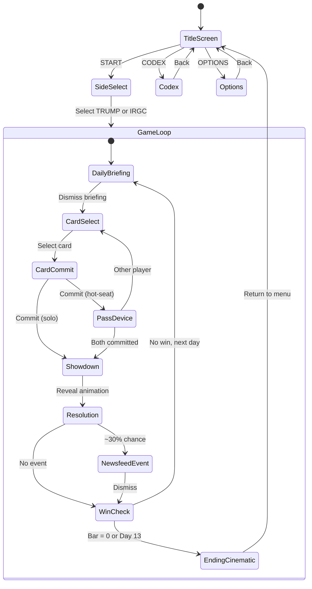
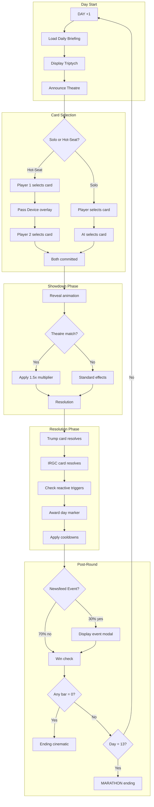
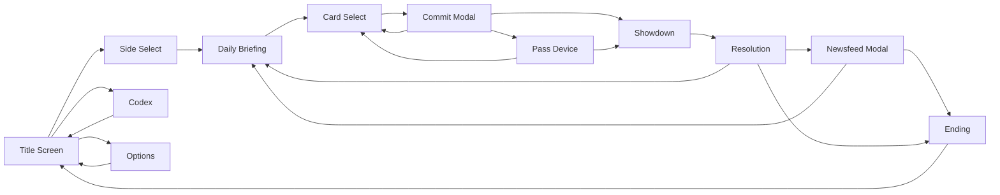

# 05 — Screens and Flow

> Wireframe-level UI layouts for every screen at 1280×720, plus round-flow state diagrams.
> Cross-references: `01_OVERVIEW.md` §7 (round flow), §12 (visual style).

---

## A. Game Flow State Diagram



---

## B. Screen Wireframes

All screens are **1280 × 720 px**. Coordinates given as (x, y) from top-left.

### B1. Title Screen

**Background:** `bg_title.png` — Lion & Sun rising at dawn over Tehran silhouette

```
┌────────────────────────────────────────────────────────────────────────────────┐
│                                                                                │
│                                                                                │
│                         [LION & SUN LOGO — 192×192]                            │
│                              (center, y=120)                                   │
│                                                                                │
│                                                                                │
│                      ╔══════════════════════════════════╗                      │
│                      ║    O P E R A T I O N :           ║                      │
│                      ║    CROUCHING LION                ║                      │
│                      ╚══════════════════════════════════╝                      │
│                           Press Start 2P, 24px                                 │
│                              (center, y=340)                                   │
│                                                                                │
│                                                                                │
│                            [ S T A R T ]                                       │
│                              (center, y=480)                                   │
│                                                                                │
│                            [  C O D E X  ]                                     │
│                              (center, y=540)                                   │
│                                                                                │
│                            [ O P T I O N S ]                                   │
│                              (center, y=600)                                   │
│                                                                                │
│  v1.0                                                              Audio: ON   │
│  (16, 696)                                                        (1200, 696)  │
└────────────────────────────────────────────────────────────────────────────────┘
```

**Elements:**
- Logo: `icon_lion_sun.png` scaled to 192×192 (6× from 32×32) or custom 192×192 version
- Title: Press Start 2P, 24px, gold `#ffd24a`
- Buttons: Press Start 2P, 14px, off-white `#fafff7`, green hover glow

---

### B2. Side Select

**Background:** Split — left half green tint (CENTCOM), right half red tint (Tehran Bunker)

```
┌────────────────────────────────────────────────────────────────────────────────┐
│                           CHOOSE YOUR SIDE                                     │
│                        Press Start 2P, 16px, gold                              │
│                              (center, y=60)                                    │
├───────────────────────────────────┬────────────────────────────────────────────┤
│                                   │                                            │
│        [MAXJAW TRUMP              │           [IRGC COMMANDER                  │
│         portrait 192×192]         │            portrait 192×192]               │
│           (320, 180)              │              (960, 180)                    │
│                                   │                                            │
│      ╔═══════════════════╗        │        ╔═══════════════════╗               │
│      ║  J A W - M A X X  ║        │        ║  I R G C  H I G H ║               │
│      ║     T R U M P     ║        │        ║   C O M M A N D   ║               │
│      ╚═══════════════════╝        │        ╚═══════════════════╝               │
│         green text                │           red text                         │
│                                   │                                            │
│    "Crush the regime in          │     "Outlast the offensive.               │
│     13 days."                     │      Break their will."                   │
│       VT323, 12px                 │        VT323, 12px                        │
│                                   │                                            │
│       [ S E L E C T ]             │         [ S E L E C T ]                    │
│         (320, 580)                │           (960, 580)                       │
│                                   │                                            │
├───────────────────────────────────┴────────────────────────────────────────────┤
│                                                                                │
│     [ 2 - P L A Y E R   H O T - S E A T ]        [ S O L O   v s   A I ]       │
│              (400, 660)                               (880, 660)               │
│                                                                                │
└────────────────────────────────────────────────────────────────────────────────┘
```

**Elements:**
- Portraits: 192×192 (2× from 96×96)
- Side names: Press Start 2P, 14px
- Descriptions: VT323, 12px
- Mode toggle: Selected mode has gold underline

---

### B3. Daily Briefing

**Background:** `bg_centcom.png` or `bg_tehran_bunker.png` (based on player side)

```
┌────────────────────────────────────────────────────────────────────────────────┐
│  DAY 3                                                           [SKIP >>]    │
│  Press Start 2P, 12px                                             (1200, 16)  │
│  (16, 16)                                                                      │
├────────────────────────────────────────────────────────────────────────────────┤
│                                                                                │
│  ┌─────────────────────┐ ┌─────────────────────┐ ┌─────────────────────┐       │
│  │ POTUS POST          │ │ STATE BROADCAST     │ │ INTEL FEED          │       │
│  │ TRUTH SOCIAL—02:47Z │ │ IRIB                │ │ DRONE—MQ-9, 04:12Z  │       │
│  │ green trim          │ │ red trim            │ │ gold trim           │       │
│  │                     │ │                     │ │                     │       │
│  │ [Portrait 96×96]    │ │ [Portrait 96×96]    │ │ [Scene 160×90]      │       │
│  │                     │ │                     │ │                     │       │
│  │ "STRAIT IS OPEN!!!" │ │ "The vipers will    │ │ Dawn drone footage  │       │
│  │ "TANKERS MOVING..." │ │ perish in the       │ │ shows US destroyer  │       │
│  │                     │ │ Persian Gulf..."    │ │ escorting tanker... │       │
│  │                     │ │                     │ │                     │       │
│  │     [384×256]       │ │     [384×256]       │ │     [384×256]       │       │
│  └─────────────────────┘ └─────────────────────┘ └─────────────────────┘       │
│       (64, 80)              (448, 80)               (832, 80)                  │
│                                                                                │
├────────────────────────────────────────────────────────────────────────────────┤
│                                                                                │
│                    ╔═══════════════════════════════════════╗                   │
│                    ║  TODAY'S THEATRE:  S E A              ║                   │
│                    ║  Cards tagged SEA play at 1.5× effect ║                   │
│                    ╚═══════════════════════════════════════╝                   │
│                           gold border, center, y=560                           │
│                                                                                │
│                          [ C O N T I N U E ]                                   │
│                              (center, y=660)                                   │
│                                                                                │
└────────────────────────────────────────────────────────────────────────────────┘
```

**Elements:**
- Three Communication Panels (384×256 each, scaled from 480×270 design)
- Theatre announcement: Press Start 2P, 14px, gold border, icon for theatre

---

### B4. Card Select / Arena

**Background:** `bg_persian_gulf_map.png`

```
┌────────────────────────────────────────────────────────────────────────────────┐
│  DAY 3 — SEA THEATRE                                                           │
│  (16, 8)                                                                       │
├──────────────────────────────────────────────────┬─────────────────────────────┤
│                                                  │    RESOURCE BARS            │
│     ┌─────────────────────────────────────┐      │                             │
│     │                                     │      │  YOUR SIDE (Trump):         │
│     │      SITUATION MAP                  │      │  ████████░░ LEV  30         │
│     │      (Persian Gulf)                 │      │  ██████████████░ POL 60     │
│     │                                     │      │  ██████████░░░░ ALL 50      │
│     │      Ship positions                 │      │                             │
│     │      Strike markers                 │      │  OPPONENT (IRGC):           │
│     │      Day markers                    │      │  █████████░░░░ GRIP 45      │
│     │                                     │      │  ██████████░░░░ CHEST 50    │
│     │         [640×360]                   │      │  ██████████░░░░ PROXY 50    │
│     │                                     │      │                             │
│     └─────────────────────────────────────┘      │    (1040, 80)               │
│              (32, 80)                            │                             │
├──────────────────────────────────────────────────┴─────────────────────────────┤
│                                                                                │
│   YOUR ROSTER — Select a card to commit                                        │
│   (16, 460)                                                                    │
│                                                                                │
│   ┌──────┐ ┌──────┐ ┌──────┐ ┌──────┐ ┌──────┐ ┌──────┐ ┌──────┐ ┌──────┐ ┌──────┐
│   │CONFUSE│ │AIR-  │ │BLOCK-│ │ESCORT│ │SANC- │ │DIPLO-│ │SELL  │ │ARM   │ │INVADE│
│   │      │ │STRIKE│ │ADE   │ │      │ │TION  │ │MACY  │ │OIL   │ │JAVID │ │      │
│   │ 80×120│ │ 80×120│ │ 80×120│ │ 80×120│ │ 80×120│ │ 80×120│ │ 80×120│ │ 80×120│ │ 80×120│
│   │      │ │      │ │      │ │      │ │      │ │      │ │      │ │      │ │      │
│   │[COOL]│ │      │ │      │ │      │ │      │ │[LOCK]│ │      │ │      │ │[LOCK]│
│   └──────┘ └──────┘ └──────┘ └──────┘ └──────┘ └──────┘ └──────┘ └──────┘ └──────┘
│    (40)    (168)    (296)    (424)    (552)    (680)    (808)    (936)   (1064)  │
│                                                                                │
│   [COOL] = On cooldown (grayed, badge)   [LOCK] = Gate not met (padlock icon)  │
│                                                                                │
└────────────────────────────────────────────────────────────────────────────────┘
```

**Elements:**
- Cards at 80×120 (⅓ scale of 240×360), expand to 160×240 on hover
- Cooldown overlay: gray tint + `icon_cooldown.png`
- Gate-locked overlay: gray tint + `icon_locked.png`
- Selected card: gold border glow, lifts up 8px
- Resource bars: 160px wide, color-coded (green/red)

---

### B5. Card Commit Confirmation

Modal overlay on Card Select screen.

```
┌────────────────────────────────────────────────────────────────────────────────┐
│                          (dimmed arena background)                             │
│                                                                                │
│              ┌─────────────────────────────────────────────────┐               │
│              │                                                 │               │
│              │        COMMIT THIS CARD?                        │               │
│              │        Press Start 2P, 14px                     │               │
│              │                                                 │               │
│              │   ┌─────────────────────────┐                   │               │
│              │   │                         │                   │               │
│              │   │     [SELECTED CARD      │                   │               │
│              │   │      240×360]           │                   │               │
│              │   │                         │                   │               │
│              │   │     e.g. BLOCKADE       │                   │               │
│              │   │                         │                   │               │
│              │   └─────────────────────────┘                   │               │
│              │                                                 │               │
│              │   Effects preview:                              │               │
│              │   +5 LEV, −2 POL / −8 CHEST                     │               │
│              │   (1.5× if SEA theatre)                         │               │
│              │                                                 │               │
│              │   [ C O N F I R M ]     [ C A N C E L ]         │               │
│              │                                                 │               │
│              └─────────────────────────────────────────────────┘               │
│                              (center, 520×480)                                 │
│                                                                                │
└────────────────────────────────────────────────────────────────────────────────┘
```

---

### B6. Pass Device (Hot-Seat Only)

**Background:** `bg_pass_device.png` — solid `#06080c` with Lion & Sun

```
┌────────────────────────────────────────────────────────────────────────────────┐
│                                                                                │
│                                                                                │
│                                                                                │
│                                                                                │
│                         [LION & SUN ICON — 256×256]                            │
│                              gold #ffd24a                                      │
│                              (center, y=200)                                   │
│                                                                                │
│                                                                                │
│                      ╔══════════════════════════════════╗                      │
│                      ║                                  ║                      │
│                      ║    P A S S   D E V I C E         ║                      │
│                      ║                                  ║                      │
│                      ║    to  I R G C  P L A Y E R      ║                      │
│                      ║                                  ║                      │
│                      ╚══════════════════════════════════╝                      │
│                           Press Start 2P, 18px                                 │
│                           gold text, center                                    │
│                                                                                │
│                                                                                │
│                        [ T A P   T O   C O N T I N U E ]                       │
│                              (center, y=620)                                   │
│                              pulses slowly                                     │
│                                                                                │
└────────────────────────────────────────────────────────────────────────────────┘
```

---

### B7. Showdown / Reveal

**Background:** `bg_persian_gulf_map.png` (dimmed)

```
┌────────────────────────────────────────────────────────────────────────────────┐
│                                                                                │
│                              R E V E A L                                       │
│                           Press Start 2P, 20px                                 │
│                                                                                │
│                                                                                │
│       ┌─────────────────────┐           ┌─────────────────────┐                │
│       │                     │           │                     │                │
│       │                     │           │                     │                │
│       │     YOUR CARD       │    VS     │    OPPONENT CARD    │                │
│       │     480×720         │           │     480×720         │                │
│       │     (2× scale)      │           │     (2× scale)      │                │
│       │                     │           │                     │                │
│       │     BLOCKADE        │           │   HARASS STRAIT     │                │
│       │     green border    │           │     red border      │                │
│       │                     │           │                     │                │
│       │                     │           │                     │                │
│       └─────────────────────┘           └─────────────────────┘                │
│            (160, 80)                         (720, 80)                         │
│                                                                                │
│                                                                                │
│                        [ R E S O L V E ]                                       │
│                           (center, y=680)                                      │
│                                                                                │
└────────────────────────────────────────────────────────────────────────────────┘
```

**Animation sequence:**
1. Cards flip from face-down
2. Theatre check — if matching, "×1.5!" flashes
3. Auto-advance to Resolution after 2 seconds or tap

---

### B8. Resolution

**Background:** `bg_persian_gulf_map.png`

```
┌────────────────────────────────────────────────────────────────────────────────┐
│                                                                                │
│       ┌──────────────────┐                    ┌──────────────────┐             │
│       │  YOUR CARD       │                    │  OPPONENT CARD   │             │
│       │  160×240         │                    │  160×240         │             │
│       │  BLOCKADE        │                    │  HARASS STRAIT   │             │
│       └──────────────────┘                    └──────────────────┘             │
│            (80, 40)                                (1040, 40)                  │
│                                                                                │
├────────────────────────────────────────────────────────────────────────────────┤
│                                                                                │
│     TRUMP RESOLVES:                      IRGC RESOLVES:                        │
│     +7 LEV (×1.5)                        −4 LEV                                │
│     −3 POL (×1.5)                        −9 POL (×1.5)                         │
│     — / −12 CHEST (×1.5)                 −3 ALL (×1.5)                         │
│                                          — / −7 PROXY (×1.5)                   │
│                                                                                │
│     (animated bar changes)                                                     │
│                                                                                │
├────────────────────────────────────────────────────────────────────────────────┤
│                                                                                │
│  YOUR SIDE (Trump):                 OPPONENT (IRGC):                           │
│  ████████████░░░░░░ LEV  37 (+7)    ██████████░░░░░░░░ GRIP 45 (—)             │
│  █████████████░░░░░ POL  57 (−3)    ██████░░░░░░░░░░░░ CHEST 38 (−12)          │
│  ████████████░░░░░░ ALL  47 (−3)    ████████░░░░░░░░░░ PROXY 43 (−7)           │
│                                                                                │
│                                                                                │
│                    ╔═══════════════════════════════════╗                       │
│                    ║  IRGC WINS THE DAY                ║                       │
│                    ║  (dealt 16 damage vs your 12)     ║                       │
│                    ╚═══════════════════════════════════╝                       │
│                                                                                │
│                          [ C O N T I N U E ]                                   │
│                                                                                │
└────────────────────────────────────────────────────────────────────────────────┘
```

**Animation sequence:**
1. Trump's effects animate first (bars slide)
2. IRGC's effects animate second
3. Day-marker awarded based on damage dealt
4. Cooldown badges appear on played cards

---

### B9. Newsfeed Event Modal

Overlay on Resolution screen (~30% of rounds).

```
┌────────────────────────────────────────────────────────────────────────────────┐
│                          (dimmed resolution background)                        │
│                                                                                │
│        ┌──────────────────────────────────────────────────────────────┐        │
│        │  N E W S F E E D   E V E N T                                 │        │
│        │  Press Start 2P, 12px, gold                                  │        │
│        ├──────────────────────────────────────────────────────────────┤        │
│        │                                                              │        │
│        │  [PORTRAIT 192×192]     PAHLAVI ADDRESS                      │        │
│        │                         EXILE BROADCAST                      │        │
│        │                                                              │        │
│        │                         "I do not seek a throne.             │        │
│        │                          I seek a free Iran."                │        │
│        │                                                              │        │
│        │                         VT323, 14px                          │        │
│        │                                                              │        │
│        │  ┌────────────────────────────────────────────────────┐      │        │
│        │  │ [SCENE ART 320×180]                                │      │        │
│        │  │  pahlavi_address.png                               │      │        │
│        │  └────────────────────────────────────────────────────┘      │        │
│        │                                                              │        │
│        │  EFFECT: −5 GRIP, +5 LEV                                     │        │
│        │          Queues +8 STREET-event chance                       │        │
│        │                                                              │        │
│        │                  [ D I S M I S S ]                           │        │
│        │                                                              │        │
│        └──────────────────────────────────────────────────────────────┘        │
│                              (center, 720×540)                                 │
│                                                                                │
└────────────────────────────────────────────────────────────────────────────────┘
```

---

### B10. Ending Cinematic

**Background:** Ending-specific scene (e.g., `ending_lion_rises.png`)

```
┌────────────────────────────────────────────────────────────────────────────────┐
│                                                                                │
│                                                                                │
│     ┌──────────────────────────────────────────────────────────────────────┐   │
│     │                                                                      │   │
│     │                                                                      │   │
│     │                    [ENDING SCENE 960×540]                            │   │
│     │                    (centered, scaled 2×)                             │   │
│     │                                                                      │   │
│     │                    e.g. THE LION RISES                               │   │
│     │                    Lion & Sun over Azadi Tower                       │   │
│     │                                                                      │   │
│     │                                                                      │   │
│     └──────────────────────────────────────────────────────────────────────┘   │
│                              (160, 40)                                         │
│                                                                                │
│     ╔══════════════════════════════════════════════════════════════════════╗   │
│     ║                                                                      ║   │
│     ║  T H E   L I O N   R I S E S                                         ║   │
│     ║                                                                      ║   │
│     ║  The regime's grip has collapsed. Dawn breaks over Azadi Tower       ║   │
│     ║  as millions flood the streets — this time, not to protest,          ║   │
│     ║  but to celebrate. The Lion & Sun rises. A transitional government   ║   │
│     ║  convenes. The Iran Prosperity Project begins.                       ║   │
│     ║                                                                      ║   │
│     ║  "We will see each other in Free Iran."                              ║   │
│     ║                                                                      ║   │
│     ╚══════════════════════════════════════════════════════════════════════╝   │
│                              (160, 600)                                        │
│                                                                                │
│                          [ R E T U R N   T O   M E N U ]                       │
│                                   (center, y=700)                              │
│                                                                                │
└────────────────────────────────────────────────────────────────────────────────┘
```

**Epilogue text:**
- Press Start 2P for title
- VT323 for body
- Trump-side endings close with locked sign-off
- IRGC-side endings have sober epilogue
- Stalemate has hopeful-tired tone

---

### B11. Codex

**Background:** `bg_centcom.png` (dimmed)

```
┌────────────────────────────────────────────────────────────────────────────────┐
│  F R E E   I R A N   C O D E X                              [ B A C K ]        │
│  Press Start 2P, 14px                                         (1180, 16)       │
├─────────────────────────────┬──────────────────────────────────────────────────┤
│                             │                                                  │
│  TOPICS                     │  MAHSA AMINI                                     │
│  (scrollable list)          │                                                  │
│                             │  [codex_mahsa.png — 320×180]                     │
│  > Mahsa Amini        [NEW] │                                                  │
│    January 8–9 Surge        │  The 22-year-old Kurdish woman whose death in    │
│    The Massacre             │  morality-police custody in September 2022       │
│    February 28 Strike       │  sparked the "Woman, Life, Freedom" movement.    │
│    Cardboard Mojtaba        │  Her name became a rallying cry.                 │
│    Reza Pahlavi             │                                                  │
│    Iran Prosperity Project  │  Key Facts:                                      │
│    Monarchists for Democracy│  • Died September 16, 2022                       │
│    The Shah's Legacy        │  • Detained for "improper hijab"                 │
│    Lion & Sun               │  • Sparked nationwide protests                   │
│    Internet Blackout        │  • Movement spread globally                      │
│    Hyperinflation           │                                                  │
│    General Strikes          │                                                  │
│    Liberated Zones          │  VT323, 12px body text                           │
│    Silent Underground       │                                                  │
│    IRGC Structure           │                                                  │
│    ...                      │                                                  │
│                             │                                                  │
│  (240 wide)                 │  (1000 wide)                                     │
│                             │                                                  │
└─────────────────────────────┴──────────────────────────────────────────────────┘
```

**Features:**
- [NEW] badge on topics referenced in current match but not yet read
- Topics unlock/highlight when encountered in play
- Scrollable left panel, content right panel

---

### B12. Options

**Background:** `bg_centcom.png` (dimmed)

```
┌────────────────────────────────────────────────────────────────────────────────┐
│  O P T I O N S                                               [ B A C K ]       │
│  Press Start 2P, 14px                                         (1180, 16)       │
├────────────────────────────────────────────────────────────────────────────────┤
│                                                                                │
│                                                                                │
│              AUDIO                                                             │
│              ════════════════════════════                                      │
│              Music:     ████████░░░░  80%     [−] [+]                          │
│              SFX:       ██████████░░  100%    [−] [+]                          │
│                                                                                │
│                                                                                │
│              GAMEPLAY                                                          │
│              ════════════════════════════                                      │
│              AI Difficulty:    [ EASY ]  [ NORMAL ]  [ HARD ]                  │
│              Skip Briefings:   [ OFF ]  [ ON ]                                 │
│              Fast Resolution:  [ OFF ]  [ ON ]                                 │
│                                                                                │
│                                                                                │
│              DISPLAY                                                           │
│              ════════════════════════════                                      │
│              Scanlines:        [ OFF ]  [ ON ]                                 │
│              CRT Curve:        [ OFF ]  [ ON ]                                 │
│                                                                                │
│                                                                                │
│              [ R E S E T   T O   D E F A U L T S ]                             │
│                                                                                │
│                                                                                │
└────────────────────────────────────────────────────────────────────────────────┘
```

---

## C. Round Flow Detail



---

## D. Screen Transition Map



---

## E. UI Component Reference

### E1. Fonts

| Use | Font | Size | Color |
|-----|------|------|-------|
| Titles | Press Start 2P | 20–24px | Gold `#ffd24a` |
| Headers | Press Start 2P | 14–16px | Off-white `#fafff7` |
| Labels | Press Start 2P | 8–12px | Side color |
| Body EN | VT323 | 12–14px | Off-white `#fafff7` |
| Body FA | Vazirmatn | 12–14px | Off-white `#fafff7` |
| Numbers | VT323 | 14px | Bar color |

### E2. Button States

| State | Border | Background | Text |
|-------|--------|------------|------|
| Default | `#fafff7` 1px | `#06080c` | `#fafff7` |
| Hover | Gold `#ffd24a` 2px | `#06080c` | `#ffd24a` |
| Active | Gold 2px | `#1a1a1a` | Gold |
| Disabled | `#333` 1px | `#06080c` | `#666` |

### E3. Card States

| State | Effect |
|-------|--------|
| Available | Normal display, green/red border |
| Hovered | Scale 1.5×, lift 8px, gold glow |
| Selected | Gold border, committed to slot |
| Cooldown | Gray overlay, cooldown badge |
| Gate-locked | Gray overlay, padlock icon |

### E4. Bar Animations

- Delta changes animate over 500ms
- Positive changes: flash side color
- Negative changes: flash opposite color
- Zero-approach: pulse warning at <20

---

*End of 05_SCREENS_AND_FLOW.md*
